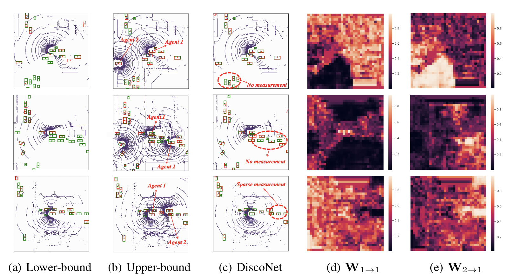

# DiscoNet: Learning Distilled Collaboration Graph for Multi-Agent Perception [NeurIPS 2021]

[Yiming Li](https://scholar.google.com/citations?user=i_aajNoAAAAJ), [Shunli Ren](https://github.com/ShunliRen), [Pengxiang Wu](https://scholar.google.com/citations?user=MXLs7GcAAAAJ&hl=en), [Siheng Chen](https://scholar.google.com/citations?user=W_Q33RMAAAAJ&hl=en), [Chen Feng](https://scholar.google.com/citations?user=YeG8ZM0AAAAJ), [Wenjun Zhang](https://www.researchgate.net/profile/Wenjun-Zhang-29)

**''Learn a digraph with matrix-valued edge weight for multi-agent perception.''**

<p align="center"> </p>
  
  
## News
**[2021-10]**  Our paper is availale on [arxiv](https://arxiv.org/pdf/2111.00643.pdf).

**[2021-10]**  Our dataset **V2X-Sim 1.0** is availale [here](https://ai4ce.github.io/V2X-Sim/).

**[2021-09]**  🔥 DiscoNet is accepted at **NeurIPS 2021**.

## Abstract
To promote better performance-bandwidth trade-off for multi-agent perception, we propose a novel distilled collaboration graph (DiscoGraph) to model trainable, pose-aware, and adaptive collaboration among agents. Our key novelties lie in two aspects. First, we propose a teacher-student framework to train DiscoGraph via knowledge distillation. The teacher model employs an early collaboration with holistic-view inputs; the student model is based on intermediate collaboration with single-view inputs. Our framework trains DiscoGraph by constraining post-collaboration feature maps in the student model to match the correspondences in the teacher model. Second, we propose a matrix-valued edge weight in DiscoGraph. In such a matrix, each element reflects the inter-agent attention at a specific spatial region, allowing an agent to adaptively highlight the informative regions. During inference, we only need to use the student model named as the distilled collaboration network (DiscoNet). Attributed to the teacher-student framework, multiple agents with the shared DiscoNet could collaboratively approach the performance of a hypothetical teacher model with a holistic view. Our approach is validated on V2X-Sim 1.0, a large-scale multi-agent perception dataset that we synthesized using CARLA and SUMO co-simulation. Our quantitative and qualitative experiments in multi-agent 3D object detection show that DiscoNet could not only achieve a better performance-bandwidth trade-off than the state-of-the-art collaborative perception methods, but also bring more straightforward design rationale. Our code is available on https://github.com/ai4ce/DiscoNet.

## Installation
### Requirements
* Linux (tested on Ubuntu 20.04)
* Python 3.7
* PyTorch 1.8.0
* CUDA 11.2

### Create Anaconda Environment
```bash
conda env create -f disco.yaml
conda activate disco
```

## Dataset Preparation
Please download the training/val set [**V2X-Sim-1.0-trainval**](https://drive.google.com/file/d/11lyIaOeNMCpJkZDOydxqGBNoHiTxTgZk/view?usp=sharing).

**NOTICE**: The training/val data generation script is currently not avaliable, you can either use the raw data on [**V2X-Sim 1.0**](https://ai4ce.github.io/V2X-Sim/) or the provided [**training/val set**](https://drive.google.com/file/d/11lyIaOeNMCpJkZDOydxqGBNoHiTxTgZk/view?usp=sharing) in your experiments. Please send us an access request with your affiliation and role, and we will grant the access.

## Training Commands
```bash
python train_codet.py [--data PATH_TO_DATA] [--bound BOUND] [--com COM]
               [--batch BATCH] [--nepoch NEPOCH] [--lr LEARNING_RATE] 
               [--kd_flag KD_FLAG] [--resume_teacher PATH_TO_TRACHER_MODEL]
```

```
--bound BOUND       
                    Input data to the collaborative perception model. Options: "lowerbound" for 
                    no-collaboration or intermediate-collaboration, "upperbound" for early collaboration.
--com COM   
                    Intermediate collaboration strategy. Options: "disco" for our DiscoNet,
                    "v2v/when2com//sum/mean/max/cat/agent" for other methods, '' for early or no collaboration.
--data PATH_TO_DATA         
                    Set as YOUR_PATH_TO_DATASET/V2X-Sim-1.0-trainval/train
--kd_flag FLAG
                    Whether to use knowledge distillation. 1 for true and 0 for false.
--resume_teacher PATH_TO_TRACHER_MODEL 
                    The pretrained early-collaboration-based teacher model.

```

## Evaluation Commands
```bash
python test_codet.py [--data PATH_TO_DATA] [--bound BOUND] [--com COM] [--resume PATH_TO_YOUR_MODEL]
```

```
--bound BOUND       
                    Input data to the collaborative perception model. Options: "lowerbound" for 
                    no-collaboration or intermediate-collaboration, "upperbound" for early collaboration.
--com COM   
                    Intermediate collaboration strategy. Options: "disco" for our DiscoNet,
                    "v2v/when2com//sum/mean/max/cat/agent" for other methods, '' for early or no collaboration.
--data PATH_TO_DATA         
                    Set as YOUR_PATH_TO_DATASET/V2X-Sim-1.0-trainval/test
--resume PATH_TO_YOUR_MODEL 
                    The trained model for evaluation.

```

The teacher model can be downloaded [**here**](https://drive.google.com/file/d/13JhhlQyEEnuyI8g-Kahq3qWZH2kCbJKV/view?usp=sharing), and our DiscoNet model can can be downloaded [**here**](https://drive.google.com/file/d/1X6cEmfuRIoaDpCkG9sDUqcB7uUi3ATfc/view?usp=sharing).

## Acknowledgment  
This project is not possible without the following great codebases.
* [**MotionNet**](https://github.com/pxiangwu/MotionNet)
* [**mmdetection**](https://github.com/open-mmlab/mmdetection)
* [**nuSenes-devkit**](https://github.com/nutonomy/nuscenes-devkit)
* [**when2com**](https://github.com/GT-RIPL/MultiAgentPerception)
* [**V2X-Sim**](https://github.com/ai4ce/V2X-Sim)

## Citation
If you find V2X-Sim 1.0 or DiscoNet useful in your research, please cite our paper.
```
@InProceedings{Li_2021_NeurIPS,
    title = {Learning Distilled Collaboration Graph for Multi-Agent Perception},
    author = {Li, Yiming and Ren, Shunli and Wu, Pengxiang and Chen, Siheng and Feng, Chen and Zhang, Wenjun},
    booktitle = {Thirty-fifth Conference on Neural Information Processing Systems (NeurIPS 2021)},
    year = {2021}
}
```
